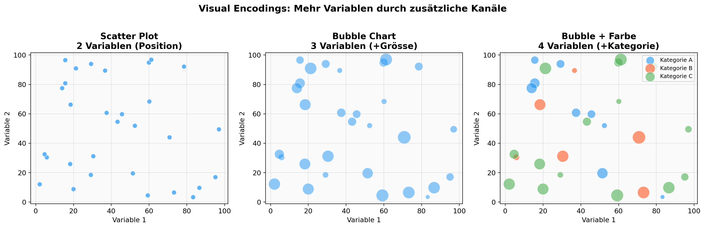
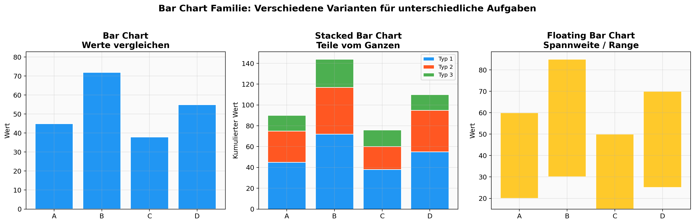
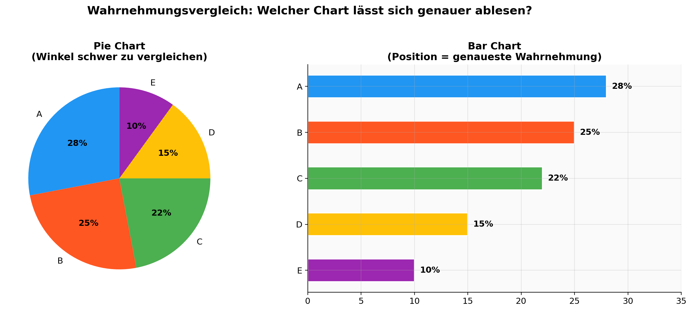
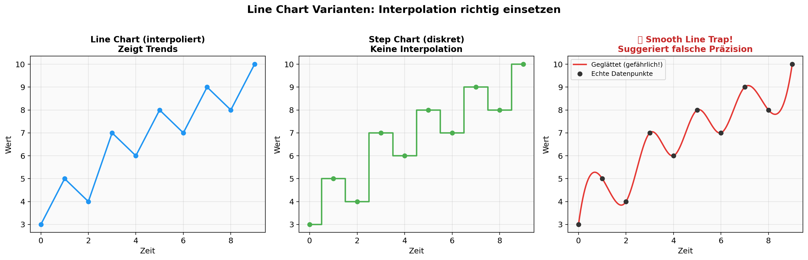
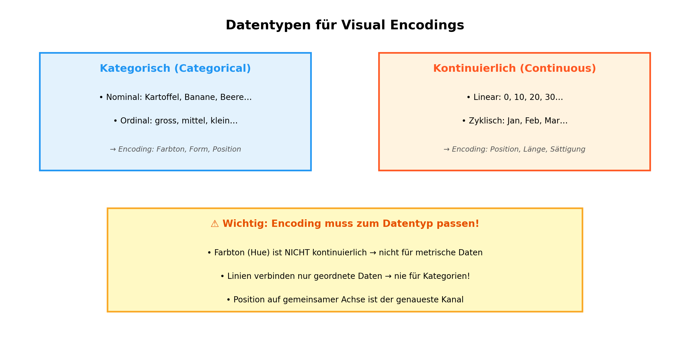
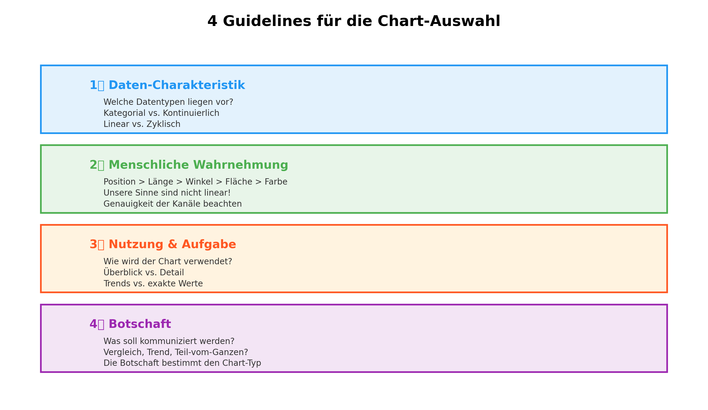
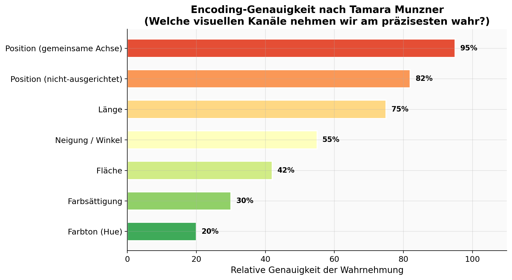
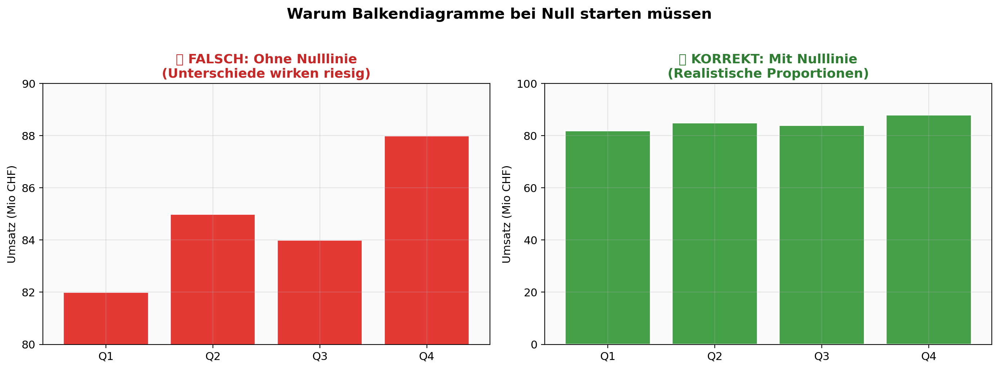

# 📊 DVIZ – Data Visualization for ML and AI

## SW 02 – Visual Encodings & Human Cognition

**Datum:** 27. Februar 2026  
**Dozentin:** Dr. Teresa Kubacka  
**Modul:** I.BA_DVIZ_MM.F2601  
**Slides:** `Slides/week-02.pdf` (89 Seiten)

---

## 🎯 Lernziele

Nach dieser Woche kannst du:

- [ ] Erklären, was **Visual Encodings** sind und wie sie Daten in visuelle Merkmale übersetzen
- [ ] Die **geometrischen Primitive** (Punkt, Linie, Fläche) und deren **Erscheinungsmerkmale** (Position, Länge, Winkel, Fläche, Farbe, Form) unterscheiden
- [ ] **Chart-Familien** analysieren: Scatter, Bar, Pie, Line und deren Varianten
- [ ] Die **4 Guidelines** zur Chart-Auswahl anwenden: Datencharakteristik, Wahrnehmung, Nutzung, Botschaft
- [ ] **Datentypen** (kategorisch vs. kontinuierlich, nominal vs. ordinal, linear vs. zyklisch) korrekt auf Encodings abbilden
- [ ] Die **Encoding-Genauigkeitshierarchie** nach Tamara Munzner kennen (Position > Länge > Winkel > Fläche > Farbe)
- [ ] **Ambiguities** und **Wahrnehmungsfallen** erkennen (3D-Charts, fehlende Nulllinie, Smooth Line Trap)
- [ ] **Chart-Kataloge** verwenden, um den richtigen Chart-Typ zu finden

---

## 🧰 Toolbox – Übersicht

> **Hinweis:** In SW02 war der Fokus auf Theorie der Visual Encodings. Coding-Übungen starten ab SW03 (nächste Woche via Zoom). Die folgenden Tools aus SW01 bleiben relevant, ergänzt um die neuen Konzept-Ressourcen.

| Tool / Bibliothek | Zweck | Import | Dokumentation |
|---|---|---|---|
| Matplotlib | Statische Plots, Basis-Bibliothek | `import matplotlib.pyplot as plt` | [matplotlib.org](https://matplotlib.org) |
| Plotly | Interaktive Visualisierungen | `import plotly.express as px` | [plotly.com](https://plotly.com/python/) |
| Streamlit | Web-basierte Dashboards & Apps | `import streamlit as st` | [streamlit.io](https://streamlit.io) |
| NumPy | Daten generieren und verarbeiten | `import numpy as np` | [numpy.org](https://numpy.org) |
| Pandas | DataFrames für strukturierte Daten | `import pandas as pd` | [pandas.pydata.org](https://pandas.pydata.org) |

**Neue Ressourcen aus SW02:**

| Ressource | Typ | Link |
|---|---|---|
| Financial Times – Visual Vocabulary | Chart-Entscheidungshilfe | [GitHub](https://github.com/Financial-Times/chart-doctor) |
| Data Viz Catalogue | Chart-Katalog | [datavizcatalogue.com](https://datavizcatalogue.com/) |
| Data to Viz | Entscheidungsbaum | [data-to-viz.com](https://www.data-to-viz.com/) |
| Python Graph Gallery | Code-Beispiele | [python-graph-gallery.com](https://www.python-graph-gallery.com/) |
| Claus Wilke – Dataviz Directory | Visualisierungsverzeichnis | [clauswilke.com](https://clauswilke.com/dataviz/directory-of-visualizations.html) |
| Data Viz Project | Chart-Vergleich | [datavizproject.com](https://datavizproject.com/) |
| Nathan Yau – Dishonest Charts | Interaktives Experiment | [flowingdata.com](https://flowingdata.com/projects/dishonest-charts/) |
| Observable – Truth about Pie Charts | Interaktive Analyse | [observablehq.com](https://observablehq.com/blog/truth-about-pie-charts) |

---

## 📐 Konzepte & Theorie

### 1. Visual Encodings – Daten visuell machen

**Kernidee:** Eine Visualisierung übersetzt Datenwerte in **visuelle Merkmale**. Dieser Prozess heisst **Visual Encoding**.

#### Geometrische Primitive und ihre Erscheinungsmerkmale

| Primitiv | Erscheinungsmerkmale | Beispiel-Chart |
|---|---|---|
| **Punkt** | Position (x, y), Grösse, Farbe, Form | Scatter Plot, Bubble Chart |
| **Linie** | Position, Länge, Neigung, Dicke, Farbe | Line Chart, Slope Chart |
| **Fläche** | Position, Grösse, Farbe, Textur | Bar Chart, Area Chart, Treemap |

#### Wie man Variablen auf Kanäle abbildet

```
Datenvariable    →    Visueller Kanal
────────────────────────────────────
Wert (metrisch)  →    Position (x/y), Länge, Fläche
Kategorie        →    Farbton (Hue), Form, Position (Achse)
Menge            →    Grösse (Bubble), Sättigung
Trend            →    Neigung (Slope), Position über Zeit
```

> **Kernregel:** Jede zusätzliche Variable braucht einen eigenen visuellen Kanal. Aber: zu viele Kanäle = unleserlich!



---

### 2. Chart-Familien und ihre Varianten

SW02 hat die vier grundlegenden Chart-Familien und ihre "Geschwister" analysiert:

#### Scatter Plot Familie

| Variante | Variablen | Encodings | Anwendung |
|---|---|---|---|
| **Scatter Plot** | 2 | Position x, Position y | Korrelation zweier Variablen |
| **Bubble Chart** | 3 | + Grösse | Zusätzliche quantitative Dimension |
| **Bubble + Farbe** | 4 | + Farbton | Kategorie-Zuordnung |
| **Bubble + Shape** | 5 | + Form | ⚠️ Wird schnell unleserlich! |

#### Bar Chart Familie

| Variante | Encoding | Anwendung |
|---|---|---|
| **Bar Chart** | Länge (Start bei 0!) | Werte vergleichen |
| **Stacked Bar** | Gestapelte Längen | Teile vom Ganzen + Vergleich |
| **Floating Bar** | Position (Start ≠ 0) | Spannweiten / Ranges |
| **Grouped Bar** | Nebeneinander | Kategorien direkt vergleichen |

> **⚠️ Wichtig:** Bar Charts IMMER bei Null starten! Die Balkenlänge codiert den Wert – ohne Nulllinie wird die Wahrnehmung verzerrt.



#### Pie Chart Familie

| Variante | Encoding | Problem |
|---|---|---|
| **Pie Chart** | Winkel + Fläche | Winkel schwer vergleichbar |
| **Donut Chart** | Winkel (ohne Mitte) | Noch schwerer vergleichbar |
| **→ Alternative** | Bar Chart | Position = genauer! |

> **Empfehlung der Dozentin:** Pie Charts möglichst durch Bar Charts ersetzen – Position ist der genaueste visuelle Kanal.



#### Line Chart Familie

| Variante | Encoding | Wichtig |
|---|---|---|
| **Line Chart** | Position + Verbindung | Nur für **geordnete** Daten (Zeit)! |
| **Step Chart** | Diskrete Stufen | Keine Interpolation |
| **Area Chart** | Linie + Füllung | Teil-vom-Ganzen über Zeit |

> **❌ Smooth Line Trap:** Niemals eine geglättete Linie durch Datenpunkte legen und als Daten darstellen! Daten = Scatter Plot, Modell = Line Plot. Linie ohne Punkte kann falsche Präzision suggerieren.

> **❌ Nie Linien für Kategorien:** Linien implizieren Interpolation → nur für stetige/geordnete Daten!



---

### 3. Datentypen und passende Encodings

Die Wahl des richtigen Encodings hängt fundamental vom **Datentyp** ab:



| Datentyp | Untertyp | Beispiel | Geeignetes Encoding |
|---|---|---|---|
| **Kategorisch** | Nominal | Kartoffel, Banane, Beere | Farbton, Form, räumliche Position |
| **Kategorisch** | Ordinal | Gross, Mittel, Klein | Farbsättigung, Grösse, Position |
| **Kontinuierlich** | Linear | 0, 10, 20, 30… | Position, Länge, Sättigung |
| **Kontinuierlich** | Zyklisch | Jan, Feb, Mar… (wiederholt) | Radiale Position, zyklische Farbskala |
| **Kontinuierlich** | Intervall | 0–9, 10–19, 20–29 | Position, Länge |

> **⚠️ Häufiger Fehler:** Farbton (Hue) ist **nicht** kontinuierlich! Verwende Farbton nur für kategorische Daten, für quantitative Daten nutze Sättigung oder Helligkeit.

---

### 4. Die 4 Guidelines zur Chart-Auswahl

Die Slides haben vier systematische Guidelines eingeführt, um den richtigen Chart-Typ zu wählen:



#### Guideline 1: Datencharakteristik beachten

| Frage | Warum wichtig? |
|---|---|
| Welche Datentypen habe ich? | Bestimmt, welche Encodings möglich sind |
| Wie viele Variablen? | Bestimmt die Komplexität des Charts |
| Sind die Daten geordnet? | Bestimmt, ob Linien/Flächen erlaubt sind |
| Gibt es Gruppen? | Bestimmt, ob Farbe/Faceting nötig ist |

> **Praxis-Tipp:** Unstrukturierte Daten können durch Feature-Extraktion strukturiert werden (z.B. Songtext → Anzahl einzigartiger Wörter).

#### Guideline 2: Menschliche Wahrnehmung respektieren

Die zentrale Erkenntnis: **Unsere Sinne sind nicht linear!** Manche visuelle Kanäle nehmen wir viel genauer wahr als andere.



**Genauigkeits-Hierarchie (Tamara Munzner):**

| Rang | Encoding | Genauigkeit | Typischer Chart |
|---|---|---|---|
| 1 🥇 | Position (gemeinsame Achse) | Sehr hoch | Bar Chart, Scatter Plot |
| 2 🥈 | Position (nicht-ausgerichtet) | Hoch | Multi-Panel Charts |
| 3 🥉 | Länge | Gut | Balkendiagramme |
| 4 | Neigung / Winkel | Mittel | Pie Chart, Slope Chart |
| 5 | Fläche | Gering | Bubble Chart, Treemap |
| 6 | Farbsättigung | Sehr gering | Heatmaps |
| 7 | Farbton (Hue) | Nur qualitativ | Kategorische Unterscheidung |

> **Konsequenz:** Die wichtigste Variable im genauesten Kanal codieren!

#### Guideline 3: Nutzung / Aufgabe bedenken

| Aufgabe des Lesers | Empfohlene Encodings | Beispiel |
|---|---|---|
| **Überblick / Big Picture** | Weniger genau, aber pattern-freundlich | Heatmap, Stacked Area |
| **Exakte Werte ablesen** | Sehr genaue Encodings | Bar Chart, Tabelle |
| **Trend erkennen** | Position über Zeit | Line Chart |
| **Vergleich zwischen Gruppen** | Gemeinsame Achse | Grouped Bar, Dot Plot |
| **Muster in Matrizen** | Farbe/Sättigung | Heatmap |

> **Aus der Vorlesung (Steve Franconeri):** Unsere Augen+Gehirn haben bevorzugte Wege, schnelle statistische Berechnungen durchzuführen! Dasselbe Dataset, anders codiert, macht verschiedene Aufgaben leichter oder schwerer.

#### Guideline 4: Die Botschaft bestimmt den Chart-Typ

| Botschaft | Chart-Typ | Beispiel |
|---|---|---|
| **Teil vom Ganzen** | Stacked Bar, Pie, Waffle | "36% der Wahlberechtigten haben gewählt" |
| **Veränderung über Zeit** | Line, Area, Slope | "Wahlbeteiligung sinkt seit 10 Jahren" |
| **Vergleich** | Bar, Dot, Grouped Bar | "Land A hat doppelt so viel wie Land B" |
| **Korrelation** | Scatter, Bubble | "Einkommen korreliert mit Bildung" |
| **Verteilung** | Histogram, Box, Violin | "Einkommen ist rechtsschief verteilt" |
| **Abweichung** | Diverging Bar, Bullet | "Performance über/unter dem Ziel" |
| **Ranking** | Sorted Bar, Bump Chart | "Top 10 Länder nach BIP" |
| **Fluss** | Sankey, Chord, Alluvial | "Wohin fliesst das Geld?" |
| **Räumlich** | Choropleth, Bubble Map | "Bevölkerungsdichte pro Kanton" |

---

### 5. Viz and Brain – Truthful Charts

#### Warum Wahrnehmung kritisch ist

Drei Kernerkenntnisse aus der Vorlesung:

1. **Unsere Sinne "verzerren"** die Interpretation visueller Signale (komprimiert, magnifiziert, linear – je nach Kanal)
2. **Visuelle Encodings haben unterschiedliche Präzision** (Position >> Fläche >> Farbe)
3. **Wahrnehmung basiert auf Vergleichen** – wir haben keinen "Massstab" im Auge

#### Implikationen für ehrliche Charts

| # | Implikation | Erklärung | Massnahme |
|---|---|---|---|
| 1 | **Vermeide 3D** | Auf 3D-Charts können wir keine relevanten Vergleiche mehr machen | 2D-Alternativen verwenden |
| 2 | **Manipulation ist erschreckend einfach** | Achsenskalierung, Encoding-Wahl und Y-Achsen-Bereich können die Interpretation komplett ändern | Ehrliche Skalierung, Nulllinie bei Balken |
| 3 | **Visuelle Features interferieren** | Wenn Formen eine Bedeutung haben, interpretieren wir sie auch als Flächen | Redundante Encodings vermeiden |
| 4 | **Daten normalisieren** | "Land doesn't vote. People do." | Absolute vs. relative Werte bewusst wählen |



> **Aus der Vorlesung:** "Remember to normalize your data!" – gleiche Daten können mit unterschiedlichen Referenzwerten komplett unterschiedlich wirken (XKCD #1138).

---

## 💻 Code-Baukasten

> **Hinweis:** In SW02 gab es keine Jupyter Notebooks. Die folgenden Snippets demonstrieren die Konzepte der Woche als **direkt wiederverwendbare Bausteine**. Ab SW03 kommen die offiziellen Coding-Übungen.

### 📊 Scatter Plot – Von einfach bis komplex

```python
import matplotlib.pyplot as plt
import numpy as np

# Daten generieren
np.random.seed(42)
n = 50
x = np.random.rand(n) * 100
y = np.random.rand(n) * 100
sizes = np.random.rand(n) * 300 + 50        # Variable 3: Grösse
categories = np.random.choice(['A', 'B', 'C'], n)  # Variable 4: Kategorie
colors = {'A': '#2196F3', 'B': '#FF5722', 'C': '#4CAF50'}

fig, ax = plt.subplots(figsize=(10, 7))

# Bubble Chart mit Farbkodierung (4 Variablen)
for cat in ['A', 'B', 'C']:
    mask = categories == cat
    ax.scatter(x[mask], y[mask], 
               s=sizes[mask],              # Encoding: Grösse = Variable 3
               c=colors[cat],              # Encoding: Farbe = Kategorie
               alpha=0.6, 
               edgecolors='white', 
               linewidth=1,
               label=f'Kategorie {cat}')

# Beschriftungen (immer machen!)
ax.set_title('Bubble Chart: 4 Variablen gleichzeitig', fontsize=14, fontweight='bold')
ax.set_xlabel('Variable 1 (Position x)', fontsize=12)
ax.set_ylabel('Variable 2 (Position y)', fontsize=12)
ax.legend(title='Variable 4', fontsize=10)
ax.grid(True, alpha=0.3)

fig.tight_layout()
# fig.savefig('bubble_chart.png', dpi=300, bbox_inches='tight')
plt.show()
```

### 📊 Bar Charts – Alle Varianten

```python
import matplotlib.pyplot as plt
import numpy as np

kategorien = ['Zürich', 'Bern', 'Luzern', 'Basel']

# === Standard Bar Chart ===
fig, ax = plt.subplots(figsize=(8, 5))
werte = [150, 120, 95, 110]
ax.bar(kategorien, werte, color='#2196F3', edgecolor='white', linewidth=1.5)
ax.set_title('Umsatz nach Stadt', fontsize=14, fontweight='bold')
ax.set_ylabel('Umsatz (Mio CHF)')
ax.set_ylim(0, max(werte) * 1.15)  # ✅ Nulllinie beibehalten!
ax.grid(axis='y', alpha=0.3)
fig.tight_layout()
plt.show()

# === Stacked Bar Chart ===
fig, ax = plt.subplots(figsize=(8, 5))
produkt_a = [60, 45, 35, 50]
produkt_b = [50, 40, 30, 35]
produkt_c = [40, 35, 30, 25]

ax.bar(kategorien, produkt_a, color='#2196F3', label='Produkt A')
ax.bar(kategorien, produkt_b, bottom=produkt_a, color='#FF5722', label='Produkt B')
bottom2 = [a + b for a, b in zip(produkt_a, produkt_b)]
ax.bar(kategorien, produkt_c, bottom=bottom2, color='#4CAF50', label='Produkt C')

ax.set_title('Umsatz nach Stadt und Produkt', fontsize=14, fontweight='bold')
ax.set_ylabel('Kumulierter Umsatz (Mio CHF)')
ax.legend()
fig.tight_layout()
plt.show()

# === Horizontaler Bar Chart (besser für viele Kategorien) ===
fig, ax = plt.subplots(figsize=(8, 5))
ax.barh(kategorien, werte, color='#4CAF50', edgecolor='white', linewidth=1.5)
ax.set_xlabel('Umsatz (Mio CHF)')
ax.set_title('Umsatz nach Stadt (horizontal)', fontsize=14, fontweight='bold')
ax.invert_yaxis()  # Grösster Wert oben
fig.tight_layout()
plt.show()
```

### 📊 Line Chart – Korrekte Verwendung

```python
import matplotlib.pyplot as plt
import numpy as np

# Zeitreihe (Line Chart ist hier korrekt!)
monate = ['Jan', 'Feb', 'Mär', 'Apr', 'Mai', 'Jun', 
           'Jul', 'Aug', 'Sep', 'Okt', 'Nov', 'Dez']
umsatz = [120, 135, 145, 160, 175, 190, 185, 170, 155, 165, 180, 210]

fig, ax = plt.subplots(figsize=(10, 5))

# ✅ Korrekt: Linie für geordnete (zeitliche) Daten
ax.plot(monate, umsatz, 'o-', color='#2196F3', linewidth=2, markersize=6, label='2025')
ax.fill_between(range(len(monate)), umsatz, alpha=0.1, color='#2196F3')

ax.set_title('Monatlicher Umsatz 2025', fontsize=14, fontweight='bold')
ax.set_ylabel('Umsatz (Mio CHF)')
ax.legend()
ax.grid(True, alpha=0.3)

# Annotationen für Höchstwert
max_idx = np.argmax(umsatz)
ax.annotate(f'Maximum: {umsatz[max_idx]}',
            xy=(max_idx, umsatz[max_idx]),
            xytext=(max_idx - 2, umsatz[max_idx] + 10),
            fontsize=10, fontweight='bold',
            arrowprops=dict(arrowstyle='->', color='#333'))

fig.tight_layout()
plt.show()
```

### 📊 Pie Chart vs. Bar Chart (Direktvergleich)

```python
import matplotlib.pyplot as plt

labels = ['Zürich', 'Bern', 'Luzern', 'Basel', 'St. Gallen']
values = [28, 25, 20, 17, 10]
colors = ['#2196F3', '#FF5722', '#4CAF50', '#FFC107', '#9C27B0']

fig, axes = plt.subplots(1, 2, figsize=(14, 5))

# ❌ Pie Chart: Winkel schwer vergleichbar
axes[0].pie(values, labels=labels, autopct='%1.0f%%', colors=colors, startangle=90)
axes[0].set_title('Pie Chart\n(Winkel schwer vergleichbar)', fontweight='bold')

# ✅ Bar Chart: Position = genauere Wahrnehmung
axes[1].barh(labels[::-1], values[::-1], color=colors[::-1], height=0.5)
for i, v in enumerate(values[::-1]):
    axes[1].text(v + 0.5, i, f'{v}%', va='center', fontweight='bold')
axes[1].set_title('Bar Chart\n(Position = genaueste Wahrnehmung)', fontweight='bold')
axes[1].set_xlim(0, 35)

fig.suptitle('Gleiche Daten – unterschiedliche Lesbarkeit', fontsize=14, fontweight='bold')
fig.tight_layout()
plt.show()
```

### 🔧 Encoding-bewusster Plot erstellen (Template)

```python
import matplotlib.pyplot as plt
import numpy as np

def encoding_aware_plot(data, x_col, y_col, size_col=None, color_col=None, title=''):
    """
    Template für einen Encoding-bewussten Plot.
    Weist die wichtigsten Variablen den genauesten Kanälen zu.
    
    Kanal-Hierarchie (nach Munzner):
    1. Position x/y → wichtigste Variablen
    2. Grösse → dritte Variable (quantitativ) 
    3. Farbton → vierte Variable (kategorisch)
    """
    fig, ax = plt.subplots(figsize=(10, 7))
    
    x = data[x_col]
    y = data[y_col]
    
    # Grösse (Variable 3 – weniger genau als Position)
    s = data[size_col] * 10 if size_col else 60
    
    # Farbe (Variable 4 – nur für Kategorien!)
    if color_col:
        for cat in data[color_col].unique():
            mask = data[color_col] == cat
            ax.scatter(data.loc[mask, x_col], data.loc[mask, y_col],
                       s=s[mask] if size_col else 60,
                       alpha=0.6, edgecolors='white', label=cat)
    else:
        ax.scatter(x, y, s=s, alpha=0.6, edgecolors='white', color='#2196F3')
    
    ax.set_xlabel(x_col, fontsize=12)
    ax.set_ylabel(y_col, fontsize=12)
    ax.set_title(title, fontsize=14, fontweight='bold')
    if color_col:
        ax.legend(title=color_col)
    ax.grid(True, alpha=0.3)
    fig.tight_layout()
    return fig, ax
```

### 💾 Professioneller Export

```python
# Aus SW01 – hier mit erweiterten Optionen

def save_professional(fig, filename, formats=['png', 'svg']):
    """Chart in mehreren Formaten speichern."""
    for fmt in formats:
        fig.savefig(
            f'{filename}.{fmt}',
            dpi=300,                    # Hohe Auflösung
            bbox_inches='tight',        # Kein Rand-Abschnitt
            facecolor='white',          # Weisser Hintergrund
            transparent=(fmt == 'svg')  # SVG transparent
        )
    print(f'✅ Gespeichert: {filename} ({", ".join(formats)})')
```

---

## 🎨 Styling & Design-Tipps

### Aus den Vorlesungsfolien abgeleitete Prinzipien

| Prinzip | Erklärung | Umsetzung |
|---|---|---|
| **Encoding-Hierarchie beachten** | Wichtigste Variable → genauester Kanal | Position für Hauptvariable, Farbe nur für Kategorien |
| **Redundante Encodings** | Gleiche Variable doppelt codieren kann helfen ODER verwirren | Bewusst einsetzen: z.B. Farbe + Position für Hervorhebung |
| **Nicht überladen** | Mehr als 4–5 Encodings → Chart wird unleserlich | Max. 3–4 Encodings pro Chart |
| **Vergleiche ermöglichen** | Wahrnehmung basiert auf Vergleichen | Gemeinsame Achsen, gleiche Skalen |
| **Datentyp respektieren** | Encoding muss zum Datentyp passen | Farb-Hue nur für Kategorien, Linien nur für geordnete Daten |
| **Referenzpunkte bieten** | Wir haben keinen "Massstab" im Auge | Gridlines, Referenzlinien, Annotationen |

### Ambiguities vermeiden

| Fehler | Problem | Lösung |
|---|---|---|
| Radius vs. Fläche bei Bubbles | Verdopplung des Radius = 4× Fläche | Immer nach **Fläche** skalieren (`s` in matplotlib ist Fläche ✅) |
| Winkel vs. Länge bei Pie Charts | Leser weiss nicht, welchen Kanal er lesen soll | Bar Chart als Alternative |
| Linien für Kategorien | Impliziert Interpolation zwischen diskreten Werten | Vermeide Linien bei nominalen Daten |
| 3D-Projektionen | Perspektive verzerrt alle Vergleiche | **Niemals 3D** für quantitative Daten |

---

## 📊 Chart-Typen der Woche

### Behandelte Chart-Typen (aus den Slides)

| Chart-Typ | Wann verwenden? | Visual Encoding | Python-Funktion |
|---|---|---|---|
| **Scatter Plot** | Korrelation 2er Variablen | Position x, y | `plt.scatter()` |
| **Bubble Chart** | 3+ Variablen anzeigen | Position + Grösse + Farbe | `plt.scatter(s=sizes, c=colors)` |
| **Bar Chart** | Werte vergleichen | Länge (ab Null!) | `plt.bar()` / `plt.barh()` |
| **Stacked Bar** | Teile vom Ganzen + Vergleich | Gestapelte Längen | `plt.bar(bottom=...)` |
| **Floating Bar** | Spannweiten / Ranges | Position (nicht bei 0) | `plt.bar(bottom=low, height=diff)` |
| **Pie Chart** | Part-to-whole (⚠️ limitiert) | Winkel + Fläche | `plt.pie()` |
| **Donut Chart** | Wie Pie, mit Mitte frei | Winkel | `plt.pie(wedgeprops={'width': 0.4})` |
| **Line Chart** | Trends über Zeit | Position + Verbindung | `plt.plot()` |
| **Step Chart** | Diskrete Zeitreihen | Stufen | `plt.step()` |
| **Area Chart** | Volumen über Zeit | Füllung unter Linie | `plt.fill_between()` |

### Komplexe Chart-Typen (erwähnt, aber noch nicht vertieft)

| Chart-Typ | Encoding | Fürs Projekt relevant? |
|---|---|---|
| Beeswarm Plot | Position + Verteilung | Ja – für Verteilungen in Gruppen |
| Chord Diagram | Fluss zwischen Kategorien | Ja – für Handels-/Beziehungsdaten |
| Heatmap | Farbsättigung in Matrix | Ja – für Korrelationen, Muster |
| Treemap | Fläche (hierarchisch) | Ja – für hierarchische Part-to-whole |
| Gantt Chart | Position + Länge auf Zeitachse | Bei Projektdaten |
| Slope Chart | Verbindung zweier Zustände | Vorher-Nachher-Vergleiche |
| Radial Bar Chart | Winkel + Länge (radial) | Ästhetisch, aber schwerer lesbar |

---

## 🔧 Tipps & Tricks

### Häufige Fehler (aus der Vorlesung)

| # | Fehler | Warum problematisch? | Besser |
|---|---|---|---|
| 1 | **Linien für Kategorien** | Suggeriert Interpolation zwischen diskreten Werten | Bar Chart verwenden |
| 2 | **3D-Charts** | Perspektive verhindert korrekte Vergleiche | 2D bleiben, Faceting nutzen |
| 3 | **Smooth Line Trap** | Geglättete Linie suggeriert falsche Präzision | Datenpunkte separat zeigen |
| 4 | **Balken ohne Nulllinie** | Unterschiede werden dramatisch übertrieben | Immer bei 0 starten |
| 5 | **Zu viele Encodings** | Chart wird unleserlich – "overloaded bubble chart" | Max. 3–4 Variablen pro Chart |
| 6 | **Farb-Hue für quantitativ** | Farbton ist nicht kontinuierlich! | Sättigung oder Helligkeit nutzen |
| 7 | **Radius statt Fläche** | Visuelle Verdopplung ≠ Datenverdopplung | `s` in matplotlib = Fläche ✅ |
| 8 | **Keine Normalisierung** | "Land doesn't vote" – absolute vs. relative Werte | Bewusst zwischen absolut/relativ wählen |

### Chart-Auswahl Cheatsheet

```
Daten analysieren → Was will ich zeigen?
│
├─ Vergleich         → Bar Chart (horizontal bei vielen Kategorien)
├─ Trend über Zeit   → Line Chart (nur geordnete Daten!)
├─ Korrelation       → Scatter Plot / Bubble Chart
├─ Verteilung        → Histogram / Box Plot / Violin
├─ Teil vom Ganzen   → Stacked Bar (nicht Pie!)
├─ Ranking           → Sorted Bar Chart
├─ Muster in Matrix  → Heatmap
└─ Geographisch      → Choropleth / Bubble Map
```

### Nützliche Ressourcen

| Ressource | Zweck | Link |
|---|---|---|
| FT Visual Vocabulary | Chart-Entscheidungshilfe nach Funktion | [GitHub](https://github.com/Financial-Times/chart-doctor) |
| Data to Viz | Interaktiver Entscheidungsbaum | [data-to-viz.com](https://www.data-to-viz.com/) |
| Python Graph Gallery | Code für jeden Chart-Typ | [python-graph-gallery.com](https://www.python-graph-gallery.com/) |
| Data Viz Catalogue | Jeder Chart erklärt | [datavizcatalogue.com](https://datavizcatalogue.com/) |
| Nathan Yau – Dishonest Charts | Interaktiv Manipulation erleben | [flowingdata.com](https://flowingdata.com/projects/dishonest-charts/) |

---

## 📋 Übungsaufgaben-Zusammenfassung

### Übung 1: Chart Dissection (In-Class)

| Aspekt | Details |
|---|---|
| **Aufgabe** | Charts analysieren: Welche geometrischen Primitive? Wie werden Daten codiert? |
| **Ziel** | Visual Encodings identifizieren und benennen können |
| **Beispiel-Charts** | Scatter Plot → Bubble Chart → Stacked Bar → Pie Chart |
| **Kernlektion** | Jeder Chart ist eine Kombination aus Primitiven + Encodings |

### Übung 2: Encodings analysieren (In-Class)

| Aspekt | Details |
|---|---|
| **Aufgabe** | Bei 8 komplexen Charts die Encodings identifizieren |
| **Charts** | Radial Bar, Treemap, Range Area, Gantt, Connected Dot, Polar Stacked Bar, Slope, Heatmap |
| **Ziel** | Encoding-Analyse bei unbekannten Charts anwenden |
| **Kernlektion** | Auch komplexe Charts bestehen aus den gleichen Grundbausteinen |

### Übung 3: Perception Accuracy (In-Class)

| Aspekt | Details |
|---|---|
| **Aufgabe** | 3 verschiedene Charts ansehen, jeweils grössten/kleinsten Wert identifizieren. Wie lange dauert es? |
| **Ziel** | Am eigenen Leib erfahren, dass Position genauer wahrgenommen wird als Fläche oder Farbe |
| **Kernlektion** | Encoding-Hierarchie (Munzner) durch Selbstversuch bestätigen |

### Übung 4: Chart-Kataloge erkunden (In-Class)

| Aspekt | Details |
|---|---|
| **Aufgabe** | In den Katalogen (datavizcatalogue.com, data-to-viz.com, python-graph-gallery.com) je 1 unbekannten Chart-Typ finden |
| **Ziel** | Repertoire an Chart-Typen erweitern |
| **Kernlektion** | Es gibt mehr als Bar, Line, Pie! Chart-Kataloge als Nachschlagewerk nutzen |

### Übung 5: Falsche Encodings finden (In-Class)

| Aspekt | Details |
|---|---|
| **Aufgabe** | Bei mehreren Charts identifizieren, welche falsche Encodings für die Datencharakteristik verwenden |
| **Ziel** | Datentyp → Encoding Mapping überprüfen können |
| **Kernlektion** | Nicht jedes Encoding passt zu jedem Datentyp |

### Übung 6: Reverse Engineer – Funktionalität eines Charts (In-Class)

| Aspekt | Details |
|---|---|
| **Aufgabe** | Verschiedene Chart-Darstellungen (inkl. Pie-Chart-Varianten) analysieren: Welche Insights sind leicht zu finden? |
| **Quelle** | Observable: "Truth about Pie Charts" |
| **Kernlektion** | Chart-Typ bestimmt, welche analytischen Aufgaben leicht oder schwer sind |

### Hausaufgabe: Reverse Engineering + Untruthful Charts

| Aspekt | Details |
|---|---|
| **Aufgabe 1** | Good/Bad/Ugly Chart nehmen, Encodings reverse-engineeren. Gibt es einen besseren Chart-Typ? |
| **Aufgabe 2** | Nathan Yau's "Dishonest Charts" Experimente durchspielen und diskutieren |
| **Ziel** | Kritisches Auge für Visual Encodings und Manipulationsmethoden entwickeln |

---

## 🔗 Projektrelevanz

### Mini-Projekt (Deadline: 31.03.2026)

| SW02-Konzept | Anwendung im Mini-Projekt |
|---|---|
| **Visual Encodings** | Analysiere das Original: Welche Encodings werden verwendet? Reproduziere sie exakt! |
| **Encoding-Hierarchie** | Verwende die genauesten Kanäle für die wichtigsten Variablen |
| **Chart-Auswahl** | Begründe deine Chart-Wahl mit den 4 Guidelines |
| **Truthful Charts** | Stelle sicher, dass deine Reproduktion keine Manipulation einführt |

### Endprojekt (Abgabe: 14.06.2026)

| SW02-Konzept | Anwendung im Endprojekt |
|---|---|
| **Encoding-Analyse** | Für jeden Chart im Projekt: Welche Encodings? Sind sie optimal? |
| **Guidelines** | Systematische Chart-Auswahl dokumentieren (im Report) |
| **Perception** | Wichtigste Insights in den genauesten Kanälen darstellen |
| **Ambiguities** | Überprüfe alle Charts auf irreführende Encodings |
| **Normalisierung** | Bei geographischen/demographischen Daten: absolut vs. relativ |

### Aufbau auf SW01

| SW01-Konzept | Vertiefung in SW02 |
|---|---|
| Comprehension Gap | → Visual Encodings sind der **Mechanismus**, über den Botschaften übertragen werden |
| "Data never speaks for itself" | → Die Wahl der Encodings **bestimmt**, was kommuniziert wird |
| Truthful Charts (allgemein) | → Konkrete **Regeln** für ehrliche Encodings (Nulllinie, 3D, Normalisierung) |
| Zielgruppe verstehen | → Die **Aufgabe** des Lesers bestimmt den besten Chart-Typ (Guideline 3) |

### Vorschau auf kommende Wochen

| SW | Thema | Baut auf SW02 auf durch... |
|---|---|---|
| SW 03 | Chart Types & Choosing Charts | Konkrete Umsetzung mit Matplotlib – die Encodings aus SW02 in Code umsetzen |
| SW 05 | Styling & Annotations | Die Referenzpunkte und Labels aus SW02 professionell gestalten |
| SW 06 | Colors | Vertiefung von Farbe als Encoding – wann Hue, wann Sättigung? |
| SW 07 | Strategies for Complexity | Umgang mit Overloaded Charts → Faceting als Alternative zu zu vielen Encodings |

---

## 📚 Quellenverzeichnis

### Vorlesungsmaterialien
- `Slides/week-02.pdf` – Visual Encodings & Human Cognition (89 Seiten)

### Referenzen aus den Slides
- Tamara Munzner – *Visualization Analysis and Design* (Encoding-Hierarchie)
- Steve Franconeri – Cognitive Science und Dataviz (Perception & Aufgaben)
- Alberto Cairo – Manipulation von Visualisierungen
- Nicolas Rougier – *10 Rules for Better Figures* (DOI: 10.1371/journal.pcbi.1003833)
- Claus Wilke – *Fundamentals of Data Visualization*
- Karim Douieb – "Land doesn't vote. People do." (Observable)
- Federica Fragapane – Data Art (Behance)
- XKCD #1138 – "Heatmap" (Normalisierung)

### Data Art Ressourcen (aus den Slides)
- Danielle Navarro: [Art from Code](https://art-from-code.netlify.app/) (R)
- Dr. Kubacka's Python-Companion: [GitHub](https://github.com/paniterka/generative_art_djnavarro)
- Nicolas Rougier: [Scientific Visualization Book](https://github.com/rougier/scientific-visualization-book)
- OpenProcessing: [openprocessing.org](https://openprocessing.org/)
- ObservableJS: [Generative Art Collection](https://observablehq.com/collection/@observablehq/generative-art)

> **Hinweis:** In SW02 waren keine Jupyter Notebooks verfügbar. Die Coding-Sessions starten ab SW03. Die Code-Snippets in diesem Dokument sind eigenständig erstellte Demonstrationen der Konzepte.
